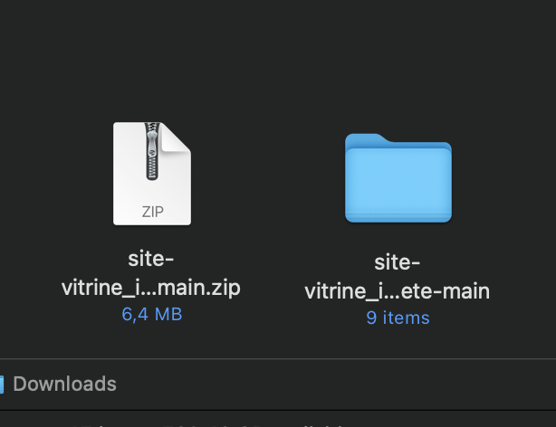
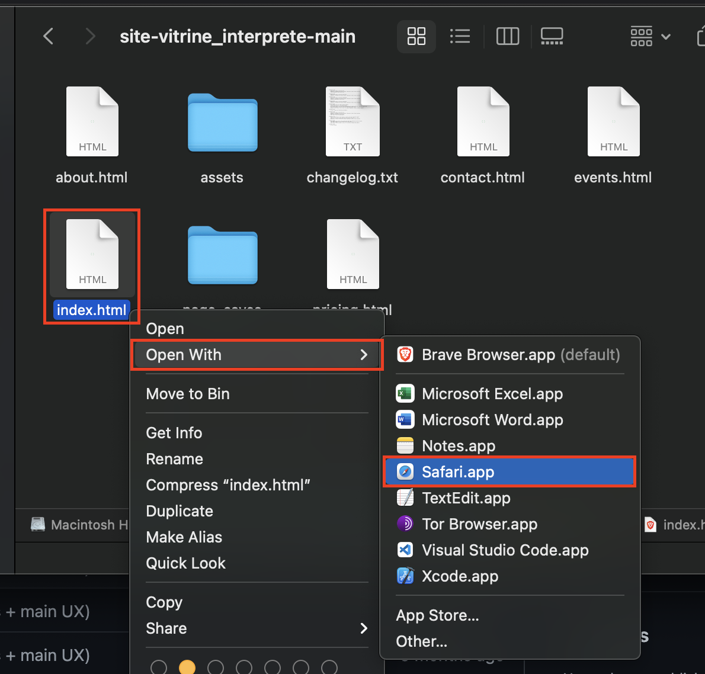
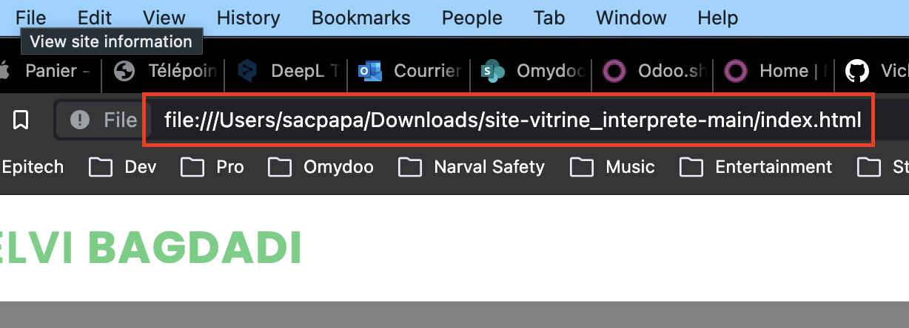

# Site vitrine - Métier d'interprête
_Thème et fonctionnalités du site vitrine édité par **Halil BAGDADI**_

## Tester le site en local sur MacOS
- Télécharger le fichier *.zip* contenant le projet
- Décompresser le fichier en double cliquant dessus

Ouvrir le fichier __index.html__ en faisant un *clic droit*, puis en séléctionnant *"ouvrir avec"*

Vous avez maintenant accès au site sur une *URL* semblable à celle-ci !

Vous pouvez naviguer dans tout le site, mais il ne sera visible que sur votre machine.

Si vous voulez mettre à jour le site, il vous faudra répéter cette opération avec le nouveau fichier *.zip*
